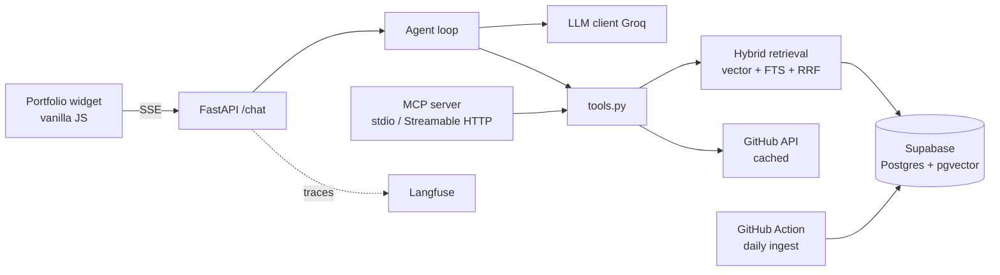

# Ask Bru

A chat agent embedded in my portfolio ([brupotrony.com](https://www.brupotrony.com)) that answers questions about me: my experience, projects, stack and availability. It uses hybrid RAG over my CV and project docs, tool calling for live data (GitHub repos, contact info), and exposes the same tools through an MCP server.


## Why this exists

I wanted a portfolio project that goes beyond a basic "chat with your PDF" demo: measurable retrieval quality, a hand-written agent loop, provider fallback, observability and CI. Asking about me is just the use case.

## Architecture



## Stack

- **Backend:** Python, FastAPI
- **LLMs:** Gemini (generation + embeddings), Groq (generation fallback), both via the OpenAI-compatible SDK
- **Vector store:** Supabase (Postgres + pgvector + full-text search)
- **Agent:** custom tool-calling loop, no LangChain
- **MCP:** official Python SDK (FastMCP)
- **Frontend:** vanilla JS widget
- **Infra:** Render, GitHub Actions, Langfuse

## Repo structure

```
ask-bru/
├── app/
│   ├── main.py          # FastAPI endpoints
│   ├── llm.py           # LLM client + fallback
│   ├── agent.py         # tool-calling loop
│   ├── tools.py         # tools (shared with MCP)
│   ├── retrieval.py     # hybrid search + RRF
│   └── mcp_server.py
├── ingest/              # sources, chunking, run.py
├── data/                # CV and source docs (.md)
├── evals/               # dataset.jsonl + run_evals.py
├── tests/
└── .github/workflows/
``

